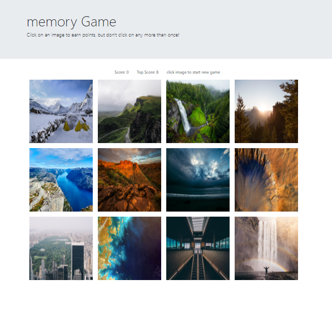

# React Memory Game 
## by Danielle Neubauer 
> A short memory game built with react featuring beautiful scenic photos from nature.

This game tests your ability to remember which photos you've clicked on. To win points, click on all the photos only once. If you click on a photo twice, you will loose and the game will restart. 

## Installation

```sh
git clone git@github.com:danineubauer/reactmemorygame.git
npm i 
npm start
```

### Screenshot of the app:



### About the app:

This app is my first React project built as a part of the UC Berkeley Coding BootCamp. The goal of this assignment was to practice building apps using React and it's functionalities. 

### Programs & technology used: 

ReactJS was used to build this application. The technologies/packages used:

* React Hooks 
* React Props
* [npm shuffle-array ](https://www.npmjs.com/package/shuffle-array)

### Enjoy the game! 


